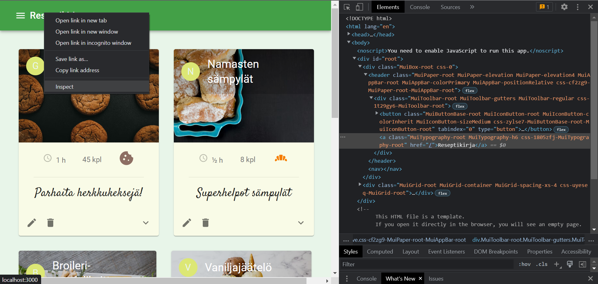
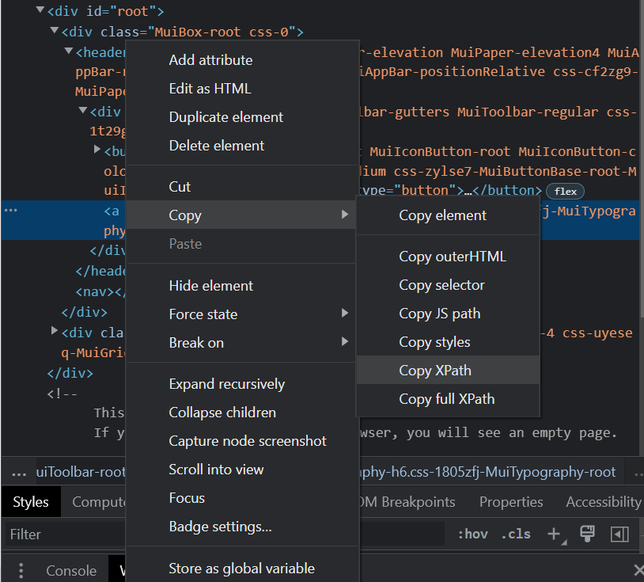
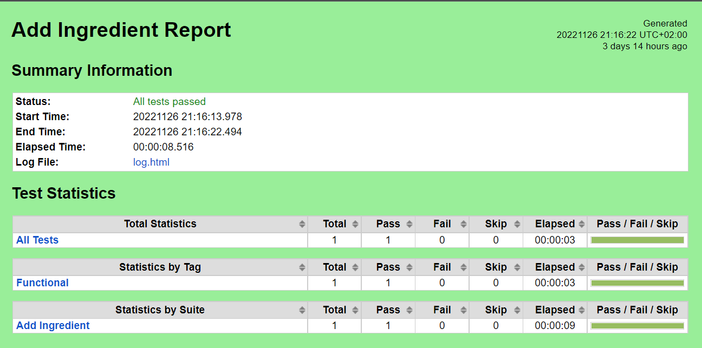
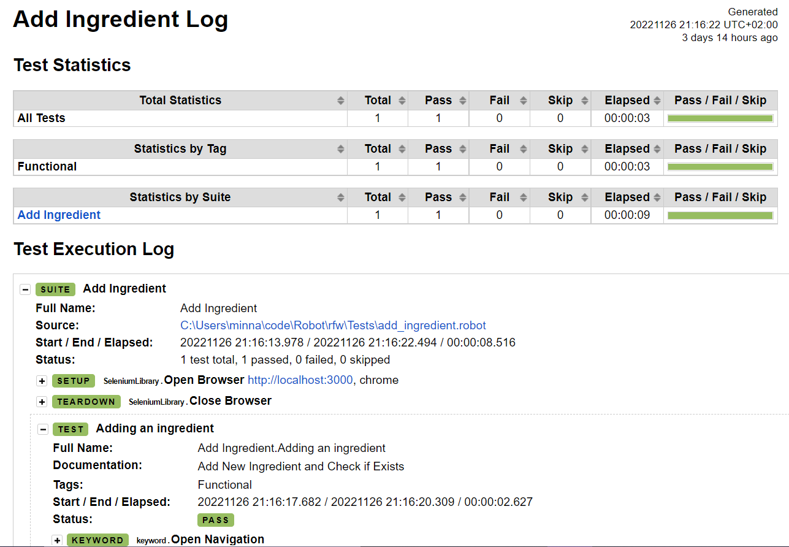

# Robot Framework
*Projektin tavoitteena on oppia Robot Frameworkin perusteet.*
### Robot Framework lyhyesti
Robot Framework on geneerinen testiautomaatiokehys hyväksymistestaukseen. Robot Frameworkin käyttämä kieli on Python,
mutta sitä voi käyttää myös muilla ohjelmointikielillä. Robot Framework on käyttöjärjestelmästä ja editorista 
riippumaton. Editorina itse käytin PyCharmia. Robot Framework hyödyntää helppolukuisia avainsanoja testauksessa. 
Tarvittavia avainsanoja voi saada käyttöön asentamalla sopivat lukuisista saatavilla olevista avainsanakirjastoista. 
Yrityksillä, jotka käyttävät Robot Frameworkia, on yleensä niiden tarpeisiin omat kattavat kirjastot. Avainsanoja voi 
myös rakentaa itse. SeleniumLibrary on hyvin yleisesti käytetty ulkoinen avainsanakirjasto.

#### Käytetyt kirjastot
* Selenium Library
* BuiltIn Library (sisältyy Robot Framework asennukseen)
* React Library

Robot Frameworkin käytössä ja hyvänä pidetyt käytänteet ovat samankaltaisia kuin muussakin ohjelmoinnissa. Testitapausten 
ja muuttujien nimeämisessä tärkeää on kuvaavuus, yksiselitteisyys ja johdonmukaisuus. Käytettävä tieto kuten käyttäjänimet 
ja salasanat, suositellaan tallentamaan muuttujiin. Testitapauksen sisällä tulisi tehdä vain kyseiseen testiin liittyviä 
tarkistuksia eikä eri testien välillä kannata olla sidonnaisuuksia.

## Projektin tavoite ja perusta
Robot Framework-osaaminen on erittäin haettua työelämässä ja uskon sen olevan hyödyllistä tulevalle uralleni. Projektin 
tavoite on saada perusymmärrys Robot Frameworkin toiminnasta ja käytöstä. Ennen Robot Frameworkiin tutustumista olin 
suunnitellut testaavani ohjelmistoprojekti 2-työtämme ja siinä tarkemmin tietokantamme toimintaa. Kävin läpi Robot 
Frameworkin saatavilla olevan dokumentaation ja löytämiäni esimerkkikoodeja. Tiedonhaun pohjalta totesin, että tietokannan 
testaaminen olisi järkevämpää yksikkötestauksella. Tavoitteena ei kuitenkaan ollut testata tietokannan toimintaa vaan 
opetella käyttämään Robot Frameworkia, joten päätin vaihtaa testattavan kohteen Front End-kurssini lopputyöhön, jota 
hyödynsin myös Docker-tehtävässä. Lopputyöni on 'Reseptikirja', joka on toteutettu Reactilla. Sovelluksessa on mahdollista 
tallentaa reseptejä, aineksia ja kategorioita, hakea reseptejä kategorian perusteella sekä toki nähdä kaikki reseptit. 
Päätin ottaa testitapauksiksi reseptin sekä aineksen lisäyksen ja reseptin haun kategorian perusteella.

### Projektin haasteet ja ratkaisut
Projektin pohjan eli testin asetusten, testitapausten, avainsanojen ja muuttujien tekeminen onnistui hyvin. Terminaali
kertoo hyvin selkeästi syyn testin epäonnistumiselle, sen perusteella ja tiedonhaulla sain ongelmat ratkaistua.
Toiminnan kohteen osoittavan xpath-polun määrittely oli kuitenkin haastavaa. Sain tähän vinkin tutulta, joka työskentelee
Robot Frameworkin kanssa. Hän neuvoi hakemaan polun selaimesta valitsemalla Inspect haettavan elementin kohdalla:



Tarvittavan xpath-polun saa kopioitua itselleen valitsemalla Inspect-ikkunasta halutun elementin:



Xpath-polun voi myös määrittää halutusta elementistä löytyvän nimen, arvon, id:n tai tekstin perusteella. Päädyin itse
käyttämään pääasiassa tätä menetelmää. Esimerkiksi ko. Reseptikirja-navigaatiolinkin voisi määrittää:
```xpath://a[contains(text(), 'Reseptikirja')]```

Esimerkiksi nimen perusteella kohdepolun voisi määrittää: ```xpath://input[@name='otsikko']```

Testien ajo tapahtuu terminaalissa: ```robot -d results tiedoston_nimi.robot```

## Projektin tulokset
#### Testitulokset

Sain toteutettua kaikki testitapaukset niin, että ne menivät läpi. Testin ajamisen jälkeen Robot Framework näyttää 
tulokset niin terminaalissa kuin luo testikansioon results-kansion, josta löytyy tulokset tiedostoina report.html, 
log.html ja output.xml, jotka voi avata selaimessa tutkittavaksi.

Report.html:


Log.html:


#### Projektirakenne
Lopuksi halusin vielä siistiä projektirakennetta, joten loin yleisesti käytetyn kansiorakenteen: Tests, Variables, 
Resources ja Library. Tests-kansioon laitetaan tiedostot, joissa määritellään ```***Settings***``` ja ```***Test Cases***```.
Näihin tiedostoihin importoidaan niiden tarvitsemat Resources-kansion tiedostot Settings alla
```Resource        ../Resources/keyword.robot``` Resources-kansiossa on tiedostot, joissa määritellään sen tiedoston
tarvitsemat ```***Settings***``` sekä ```***Keywords***```. Näihin tiedostoihin importoidaan niiden tarvitsemat
Variables-kansion tiedostot samoin kuin edellä. Variables-kansiossa on tiedostot, joissa määritellään ```Variables```.
Näin testiä on helpompi ylläpitää ja myös muiden käyttäjien on helpompi ymmärtää rakennetta ja löytää tarvittavat tiedostot.
Tapauksessa, jossa olisi itse luotuja avainsanoja, ne laitettaisiin Library-kansioon.
